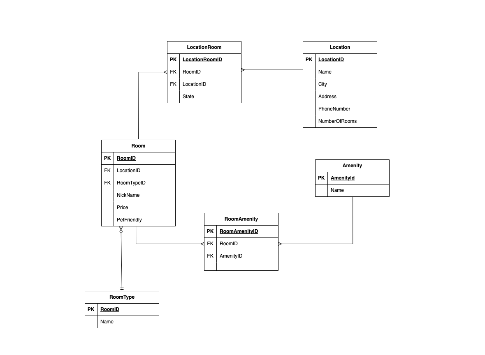
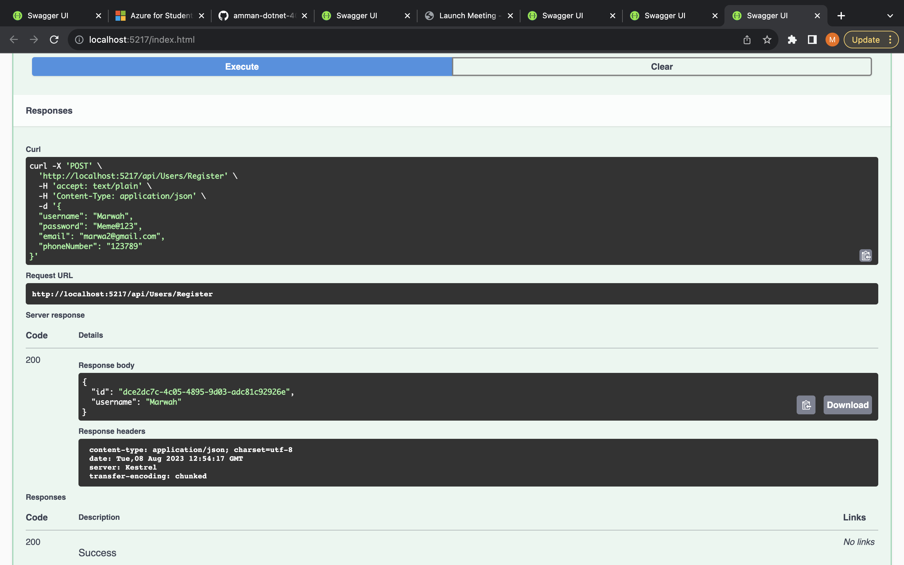
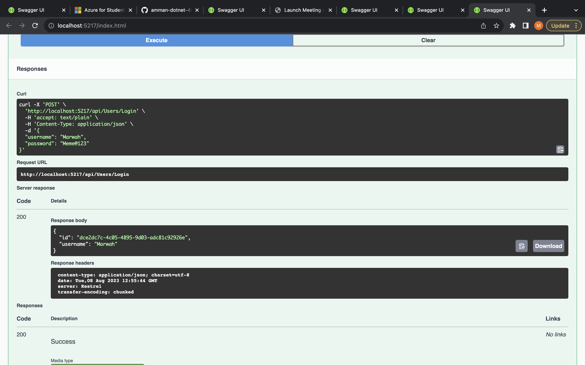

# Async-Management-System

## ERD explanation

We have many tables:
- Location: represent a branch of the hotel since we have many branches, and it has attributs: Name, City, State, Address, PhoneNumer, NumberOfRooms

- Room: represents each hotel room with attributes: RoomID, LocationId, Nickname, Price, and PetFriendly.

- Amenity: represents the available amenities with attributes: AmenityId and Name.

- RoomType Enum: represents the different types of room layouts with attributes : RoomTypeId and Name.

The relationships between the entities are as follows:

- Location and Room have a many-to-many relationship.
- Room and Amenity have a many-to-many relationship 
- Room and RoomType have a one-to-many relationship (1 RoomType can have multiple Rooms).

# Hotel Management System

Hotel Management System is an ASP.NET application designed to manage hotels, rooms, and amenities.
It is connected to a database to store and manage data.

## Controllers

The System includes the following controllers:

- `/api/Hotel`: Retrieves all hotels
- `/api/Room`: Retrieves all rooms
- `/api/Amenity`: Retrieves all amenity

## Data Seeding

The application includes data seeding functionality to add default data to the tables.

## architecture pattern
I implemented the Dependency Injection (DI) design pattern to achieve a loosely coupled architecture. 
So Instead of hardcoding dependencies within classes, DI allows us to inject the dependencies from outside the class, making the code more flexible and maintainable

#### How it is used in the app:
I define interfaces for various functionalities, such as ICourse, IHotel, and IAmenity, These interfaces serve as contracts, defining the behavior that specific classes must implement.

Then, we have service classes like CourseService, HotelService, and AmenityService, which implement the interfaces. These service classes encapsulate the actual business logic and data access operations related to their respective entities.

Routes: 

GET
/api/Amenity

POST
/api/Amenity

GET
/api/Amenity/{amenityId}

PUT
/api/Amenity/{amenityId}

DELETE
/api/Amenity/{amenityId}
Hotel

GET
/api/Hotel

POST
/api/Hotel

GET
/api/Hotel/{id}

PUT
/api/Hotel/{id}

DELETE
/api/Hotel/{id}
HotelRoom

GET
/api/HotelRoom

POST
/api/HotelRoom

GET
/api/HotelRoom/{roomNumber}

PUT
/api/HotelRoom/{roomNumber}

DELETE
/api/HotelRoom/{roomNumber}
Room

GET
/api/Room

POST
/api/Room

GET
/api/Room/{id}

PUT
/api/Room/{id}

DELETE
/api/Room/{id}

#### Lab 18

ASP.NET Identity is a framework that provides built-in user authentication and identity management functionality for ASP.NET applications.

I Integrates the Identity Framework into my Hotel API

Confirm that you can register a user successfully in the database:

Confirm that you can login with the credentials of an existing user: 

